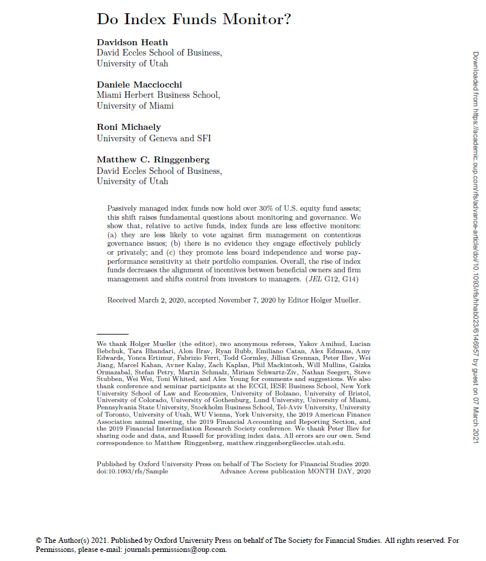
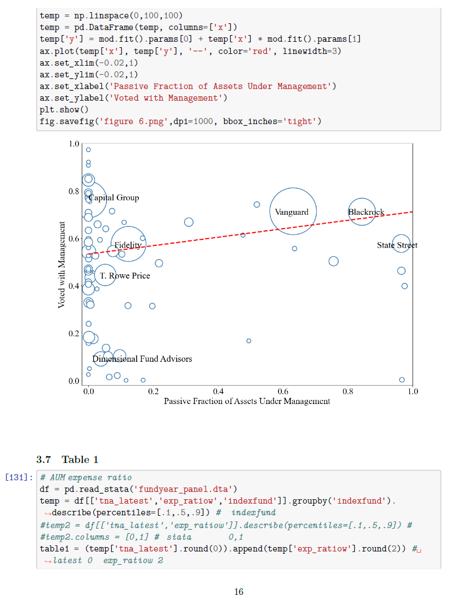
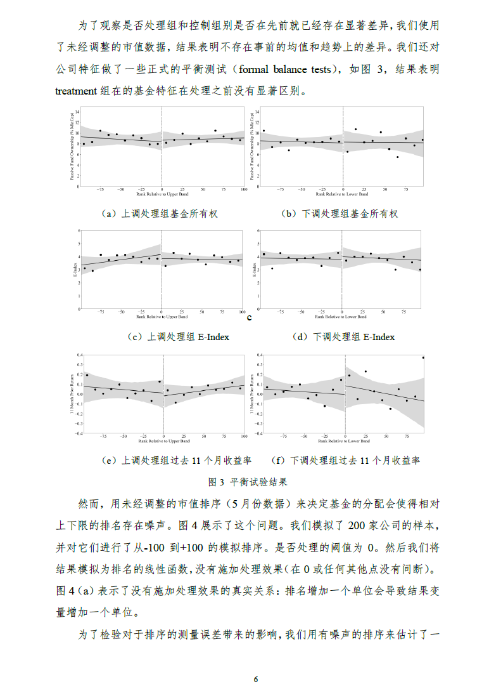

# RFS-Do-Index-Funds-Monitor
RFS2020年一篇论文的复现，观察公募基金是否参与管理造成的影响

主要工作为复现"Do Index Funds Monitor.pdf"原文中的所有实证过程。

复现的代码详见"article reprocuce code.ipynb"和打印版本"article reproduce coding report.pdf"

最终复现报告详见"article reproduce report.pdf"

